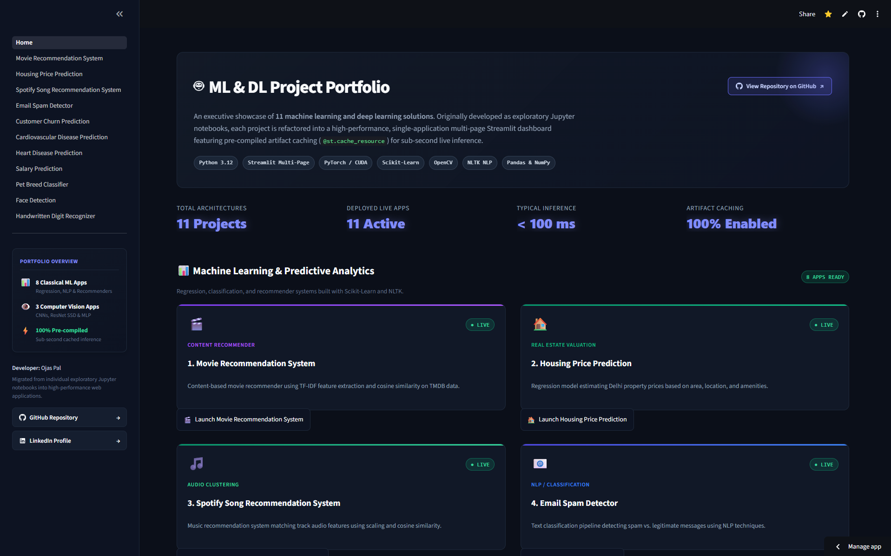
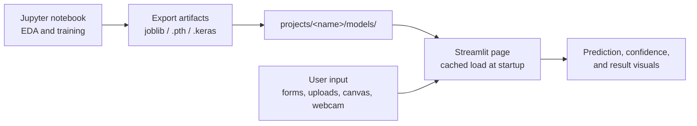

<div align="center">

# ML & DL Project Portfolio

**11 machine learning and deep learning applications, from recommender systems to fine-tuned computer vision, served as one multi-page Streamlit app.**

<a href="https://ojaspal-ml-dl-portfolio.streamlit.app"></a>

<br><br>


[Overview](#overview) · [Projects](#project-index) · [Highlights](#engineering-highlights) · [Architecture](#architecture) · [Tech Stack](#tech-stack) · [Run Locally](#run-locally) · [Author](#author)

</div>

<br>

## Overview

Each project in this portfolio began as an exploratory Jupyter notebook and was rebuilt as an interactive, deployable application. The models are trained once in their notebooks, exported as pre-compiled artifacts, and loaded at runtime, so every page responds instantly instead of retraining on load. All 11 apps share one entry point, one navigation sidebar, and one consistent dashboard design.

<p align="center">
  
</p>

## Project Index

Numbering matches the page files in [`pages/`](pages/). **Live** opens that page directly in the deployed app, **Details** opens the project's own folder (notebook, documentation, artifacts), and **Source** opens the Streamlit page code.

| # | Project | Domain | Approach | Links |
|:-:|---|---|---|---|
| 01 | **Movie Recommendation System** | Recommendation | TF-IDF vectors with cosine similarity, computed per query over 50K TMDB titles | [Live](https://ojaspal-ml-dl-portfolio.streamlit.app/Movie_Recommendation_System) · [Details](projects/movie-recommendation-system) · [Source](pages/01_Movie_Recommendation_System.py) |
| 02 | **Housing Price Prediction** | Regression | Linear Regression on standardized features and encoded localities (Delhi listings) | [Live](https://ojaspal-ml-dl-portfolio.streamlit.app/Housing_Price_Prediction) · [Details](projects/housing-price-prediction) · [Source](pages/02_Housing_Price_Prediction.py) |
| 03 | **Spotify Song Recommendation System** | Recommendation | Cosine similarity over encoded playlist metadata and standardized audio features | [Live](https://ojaspal-ml-dl-portfolio.streamlit.app/Spotify_Song_Recommendation_System) · [Details](projects/spotify-song-recommendation-system) · [Source](pages/03_Spotify_Song_Recommendation_System.py) |
| 04 | **Email Spam Detector** | NLP | NLTK stemming, TF-IDF vectorization, Logistic Regression | [Live](https://ojaspal-ml-dl-portfolio.streamlit.app/Email_Spam_Detector) · [Details](projects/email-spam-detector) · [Source](pages/04_Email_Spam_Detector.py) |
| 05 | **Customer Churn Prediction** | Classification | Logistic Regression on 19 customer account, service, and demographic features | [Live](https://ojaspal-ml-dl-portfolio.streamlit.app/Customer_Churn_Prediction) · [Details](projects/customer-churn-prediction) · [Source](pages/05_Customer_Churn_Prediction.py) |
| 06 | **Cardiovascular Disease Prediction** | Healthcare ML | Support Vector Classifier on 11 biometric and lifestyle features (70K records) | [Live](https://ojaspal-ml-dl-portfolio.streamlit.app/Cardiovascular_Disease_Prediction) · [Details](projects/cardiovascular-disease-prediction) · [Source](pages/06_Cardiovascular_Disease_Prediction.py) |
| 07 | **Heart Disease Prediction** | Healthcare ML | Logistic Regression on 13 clinical biomarkers | [Live](https://ojaspal-ml-dl-portfolio.streamlit.app/Heart_Disease_Prediction) · [Details](projects/heart-disease-prediction) · [Source](pages/07_Heart_Disease_Prediction.py) |
| 08 | **Software Salary Prediction** | Regression | CatBoost on a log-scale target with engineered company, title, and location features | [Live](https://ojaspal-ml-dl-portfolio.streamlit.app/Salary_Prediction) · [Details](projects/salary-prediction) · [Source](pages/08_Salary_Prediction.py) |
| 09 | **Pet Breed Classifier** | Computer Vision | EfficientNet-B0 fine-tuned in two stages to recognize 46 cat and dog breeds | [Live](https://ojaspal-ml-dl-portfolio.streamlit.app/Pet_Breed_Classifier) · [Details](projects/pet-breed-classifier) · [Source](pages/09_Pet_Breed_Classifier.py) |
| 10 | **Face Detection** | Computer Vision | Pre-trained OpenCV DNN (ResNet-10 SSD) with an adjustable confidence threshold | [Live](https://ojaspal-ml-dl-portfolio.streamlit.app/Face_Detection) · [Details](projects/face-detection) · [Source](pages/10_Face_Detection.py) |
| 11 | **Handwritten Digit Recognizer** | Deep Learning | Keras neural network on MNIST with a live drawing canvas | [Live](https://ojaspal-ml-dl-portfolio.streamlit.app/Handwritten_Digit_Recognizer) · [Details](projects/handwritten-digit-recognizer) · [Source](pages/11_Handwritten_Digit_Recognizer.py) |

## Engineering Highlights

- **Pre-compiled artifacts instead of retraining on load.** Models, scalers, encoders, and vectorizers are exported once from each notebook (`joblib`, `.pth`, `.keras`) and loaded at startup with `@st.cache_resource`. Several pages also include fallbacks that rebuild or approximate the artifact if it is missing, so the interface stays usable.
- **Memory-aware similarity search.** The movie recommender computes similarity on the fly for the selected title rather than storing a full N×N matrix. The Spotify page does the same when its precomputed matrix (about 8 GB) is not available, which is how it fits inside Streamlit Community Cloud's memory limits.
- **Transfer learning at scale.** The pet breed classifier fine-tunes EfficientNet-B0 on a dataset assembled from two public sources, Oxford-IIIT Pet and Stanford Dogs, covering 46 breeds, and reaches 93.6% validation accuracy.
- **Feature engineering with uncertainty estimates.** The salary model normalizes company names, tiers companies, parses seniority and job level, and clusters job titles into domains. Every estimate comes with an 80% prediction interval.
- **Reproducible data setup.** Each project ships a `download_data.py` script that fetches its dataset (via the Kaggle API or torchvision), so raw data never needs to be committed.
- **One consistent product experience.** Every page uses the same two-panel layout: an interactive panel on the left and a live architecture and documentation panel on the right.

## Architecture

### Repository Structure

```text
ML-DL-Portfolio/
├── Home.py                             # App entry point and project hub
├── pages/                              # One Streamlit page per project (sidebar order = file prefix)
│   ├── 01_Movie_Recommendation_System.py
│   ├── 02_Housing_Price_Prediction.py
│   ├── 03_Spotify_Song_Recommendation_System.py
│   ├── 04_Email_Spam_Detector.py
│   ├── 05_Customer_Churn_Prediction.py
│   ├── 06_Cardiovascular_Disease_Prediction.py
│   ├── 07_Heart_Disease_Prediction.py
│   ├── 08_Salary_Prediction.py
│   ├── 09_Pet_Breed_Classifier.py
│   ├── 10_Face_Detection.py
│   └── 11_Handwritten_Digit_Recognizer.py
├── projects/                           # Per-project notebooks, docs, and artifacts
│   ├── movie-recommendation-system/
│   ├── housing-price-prediction/
│   ├── spotify-song-recommendation-system/
│   ├── email-spam-detector/
│   ├── customer-churn-prediction/
│   ├── cardiovascular-disease-prediction/
│   ├── heart-disease-prediction/
│   ├── salary-prediction/
│   ├── pet-breed-classifier/
│   │   ├── *.ipynb                     # Original notebook: EDA, training, artifact export
│   │   ├── README.md                   # Project-level documentation
│   │   ├── download_data.py            # Dataset download script (where a dataset is needed)
│   │   ├── models/                     # Pre-compiled model artifacts loaded by the app
│   │   ├── samples/                    # Preset sample images for quick testing
│   │   └── data/                       # Downloaded datasets (gitignore protected)
│   ├── face-detection/
│   └── handwritten-digit-recognizer/
├── assets/
│   └── home-page.png
├── requirements.txt
├── LICENSE
└── README.md
```

Every project folder follows the layout shown under `pet-breed-classifier/`. Projects requiring image inputs also include a `samples/` folder with preset images for instant testing.

### From Notebook to Live App



Streamlit discovers every file in `pages/` automatically, and the zero-padded number prefixes control the sidebar order. Each page resolves its artifacts relative to the repository root, so the app behaves the same locally and in the cloud.

## Tech Stack

| Area | Tools |
|---|---|
| App and UI | Streamlit, streamlit-drawable-canvas, Plotly |
| Classical ML | scikit-learn, CatBoost |
| Deep learning | PyTorch, torchvision, TensorFlow / Keras |
| Computer vision | OpenCV (DNN module), Pillow |
| NLP | NLTK, TF-IDF (scikit-learn) |
| Data | Pandas, NumPy |
| Tooling | joblib, Kaggle API, Git and GitHub, Streamlit Community Cloud |

## Run Locally

```bash
# 1. Clone the repository
git clone https://github.com/OjasPal/ML-DL-Portfolio.git
cd ML-DL-Portfolio

# 2. Create and activate a virtual environment (Python 3.12 recommended)
python -m venv .venv
.venv\Scripts\activate          # Windows
# source .venv/bin/activate     # macOS / Linux

# 3. Install dependencies
pip install -r requirements.txt

# 4. Launch the app
streamlit run Home.py
```

The apps run from the pre-compiled artifacts committed in each project's `models/` folder, so no dataset download is needed just to use them.

**Rebuilding datasets (optional).** To retrain a model or reproduce its data, run that project's download script:

```bash
python projects/<project-folder>/download_data.py
```

Most scripts use the Kaggle API, which needs a token set in the `KAGGLE_API_TOKEN` environment variable. The Pet Breed Classifier script downloads its data directly and needs no Kaggle account. The Face Detection and Handwritten Digit Recognizer projects need no data download at all.

**Deployment.** The live app runs on Streamlit Community Cloud with Python 3.12. Free-tier apps sleep after a period of inactivity, so the first visit may show a short wake-up screen.

## Notes

- **Spotify similarity matrix:** the precomputed matrix (`spotify_similarity.joblib`, about 8 GB) is too large for GitHub and is not included. The page computes similarity on the fly instead.
- **Healthcare projects:** the Cardiovascular Disease and Heart Disease pages are machine learning demonstrations built on public datasets. They are not medical devices and do not provide medical advice or diagnosis.
- **Model scope:** each model reflects the dataset it was trained on. For example, the pet breed classifier only knows its 46 breeds, and the salary model learns from self-reported 2022 data.

## Data and Model Credits

Code in this repository is MIT licensed. Datasets and pre-trained models remain subject to their own licenses and terms.

| Project | Source |
|---|---|
| Movie Recommendation | [TMDB Movies Dataset](https://www.kaggle.com/datasets/asaniczka/tmdb-movies-dataset-2023-930k-movies) (Kaggle) |
| Housing Price | [Housing Prices in Metropolitan Areas of India](https://www.kaggle.com/datasets/ruchi798/housing-prices-in-metropolitan-areas-of-india) (Kaggle) |
| Spotify Recommendation | [30000 Spotify Songs](https://www.kaggle.com/datasets/joebeachcapital/30000-spotify-songs) (Kaggle) |
| Email Spam Detector | [Spam Mails Dataset](https://www.kaggle.com/datasets/venky73/spam-mails-dataset) (Kaggle) |
| Customer Churn | [Telco Customer Churn](https://www.kaggle.com/datasets/blastchar/telco-customer-churn) (Kaggle) |
| Cardiovascular Disease | [Cardiovascular Disease Dataset](https://www.kaggle.com/datasets/sulianova/cardiovascular-disease-dataset) (Kaggle) |
| Heart Disease | [Heart Disease Dataset](https://www.kaggle.com/datasets/johnsmith88/heart-disease-dataset) (Kaggle) |
| Salary Prediction | [Software Professional Salaries 2022](https://www.kaggle.com/datasets/iamsouravbanerjee/software-professional-salaries-2022) (Kaggle) |
| Pet Breed Classifier | [Oxford-IIIT Pet](https://www.robots.ox.ac.uk/~vgg/data/pets/) and [Stanford Dogs](http://vision.stanford.edu/aditya86/ImageNetDogs/main.html) |
| Face Detection | [OpenCV DNN Face Detector (ResNet-10 SSD)](https://github.com/opencv/opencv/tree/master/samples/dnn/face_detector) |
| Handwritten Digit Recognizer | [MNIST](https://keras.io/api/datasets/mnist/) |

## Author

**Ojas Pal**, B.Tech student in Artificial Intelligence and Data Science.

[GitHub](https://github.com/OjasPal) · [LinkedIn](https://www.linkedin.com/in/ojas-pal)

---

This project is licensed under the [MIT License](https://github.com/OjasPal/ML-DL-Portfolio/blob/main/LICENSE).
